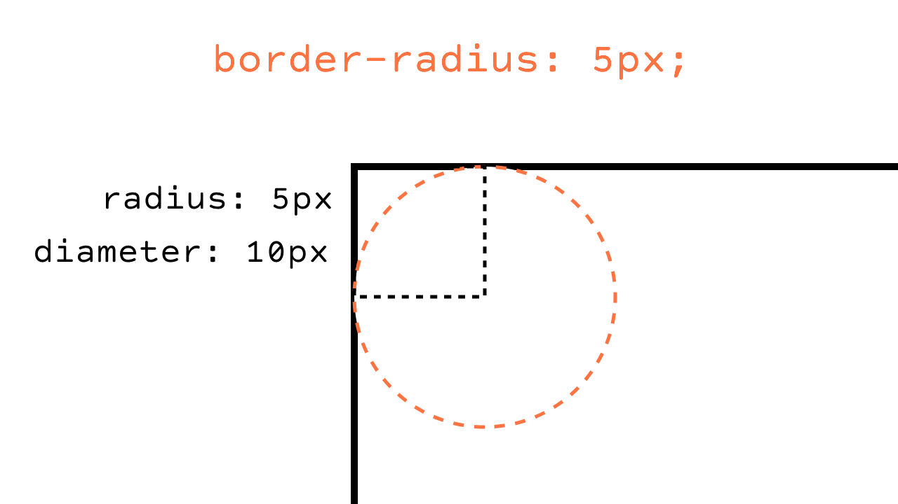
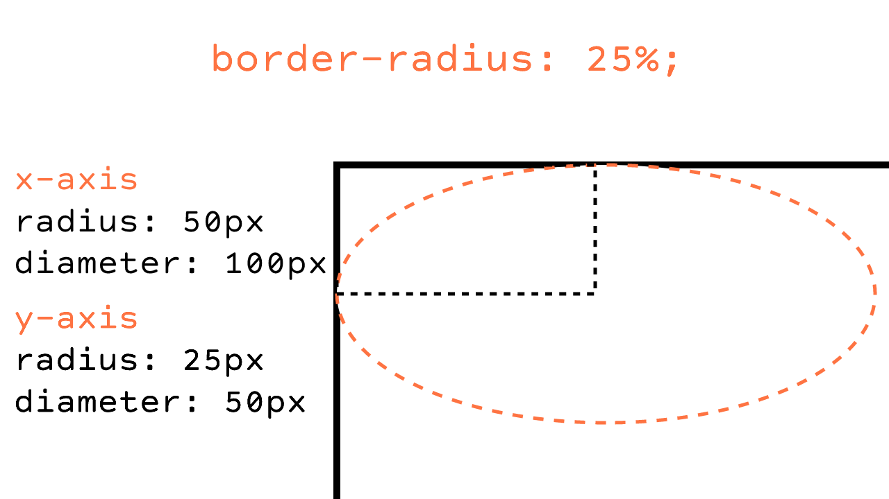

If you've ever rounded the corners of a button, you know how to use border-radius. You've probably set border radius to
`5px` to get a nice soft curve, or set it to `50%` on a square button to get a circle. But what does that value mean? How does `5px`
or `50%` translate into the amount of curve set on the corner?

I never payed much attention to this. When using border radius, I usually find a pixel value that looked nice. I never
stopped to think about what the actual value meant until the answer dawned on me one day.

Let's make a `100px by 100px` div and set the border radius to `5px`. We'll focus on the top left corner of the div.
Working from left to right, the curve will start on the left side of the div `5px` from the top, and end on
the top side of the div `5px` from the left side.

I like to picture an imaginary circle in the corner of the div. Since the radius was set to `5px`, the
diameter of the circle is `10px`. Putting that circle in the corner shows us exactly where the div will get clipped to
show a curved corner!

That explains how the curve of the corner is calcuated for a pixel value. But what about a percentage? When using a value like `25%`,
it is interpreted as percentage of each side respectively. In our example with a `100px by 100px` div, `25%` is equivalent
to a value of `25px`. If we used a value of `50%`, our div would become a perfect circle, since the height is equivalent to the width.

But what if we're working with a rectangle that doesn't have equal sides?

Let's setup a rectangular div that is `200px` wide (x-axis) and `100px` tall (y-axis) and give it a border radius of `25%`.
Again, we'll focus on the top left corner of the div. The curve will start on the left side of the div `25%` of height from the top.
Since the height is `100px` (y-axis), `25%` evaluates to `25px`. The curve will end on the top side of the div `25%` of the width from the left.
The width is `200px` (x-axis), so `25%` evaluates to `50px`;

Our circle is no longer a circle.... its an ellipse. An oblong curve like this is not very common, so you can see that
percentage values have limited use. The primary use-case for a percent value is to create perfect circle. If the element you're
applying a border radius to is not a perfect square, and you want uniform corners, you'll want to use a pixel value.

One last note, the value of the border radius will never exceede `50%` of each axis. If we use our `100px by 100px` div again and set 
a border radius of `60px`, the result will be equivalent of setting a border radius of `50px` or `50%`;

[Read more about border radius on MDN.](https://developer.mozilla.org/en-US/docs/Web/CSS/border-radius)
